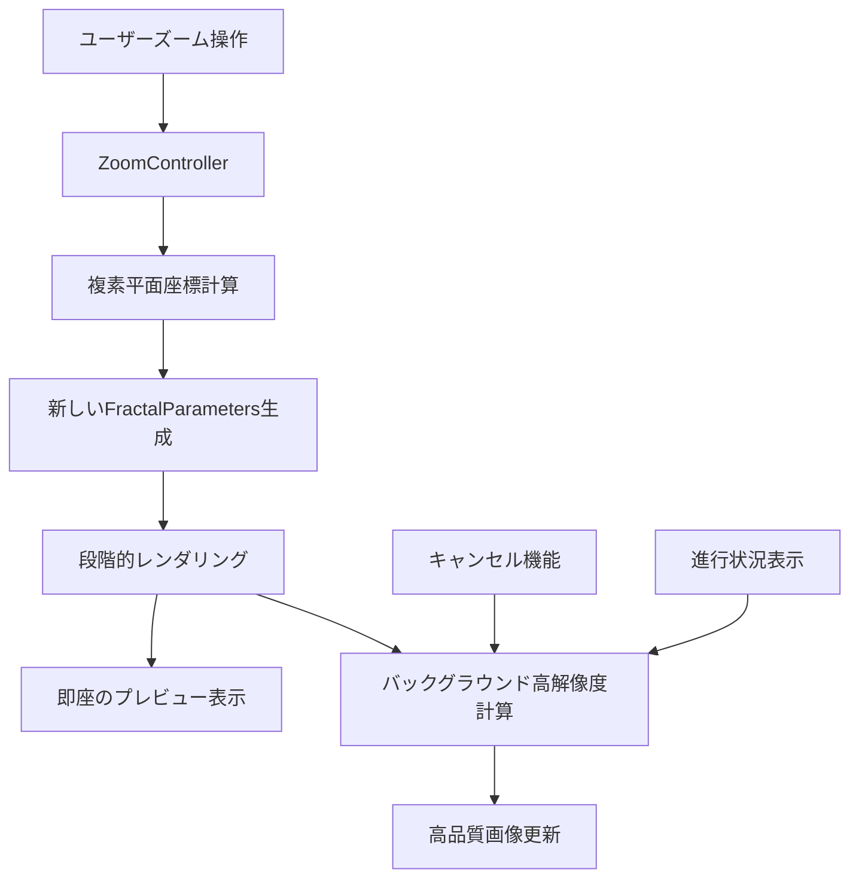

# 設計書

## 概要

フラクタルエディタのズーム機能を改善し、画像の単純な拡大縮小から真のズーム（新しい複素平面領域での高解像度再計算）に変更する。この改善により、ズーム時にフラクタルの詳細構造を鮮明に表示できるようになる。

## アーキテクチャ

### 現在の問題点

1. **画像ベースズーム**: `FractalWidget.paintEvent()`で既存のQPixmapを`scaled()`で拡大縮小
2. **品質劣化**: ズームイン時にピクセルが引き伸ばされてぼやける
3. **詳細構造の欠如**: 元の解像度以上の詳細が表示されない

### 改善後のアーキテクチャ



## コンポーネントと インターフェース

### 1. ZoomController クラス

新しいズーム制御クラスを作成し、真のズーム機能を管理する。

```python
class ZoomController:
    """
    真のズーム機能を提供するコントローラー
    複素平面座標の計算と段階的レンダリングを管理
    """
    
    def __init__(self, fractal_widget: FractalWidget, background_service: BackgroundCalculationService)
    def handle_zoom_request(self, zoom_center: QPoint, zoom_factor: float) -> None
    def calculate_new_region(self, current_region: ComplexRegion, zoom_center: QPoint, zoom_factor: float) -> ComplexRegion
    def start_staged_rendering(self, new_region: ComplexRegion, fractal_type: str, parameters: dict) -> None
    def cancel_current_zoom(self) -> None
```

### 2. FractalWidget の拡張

既存の`FractalWidget`を拡張し、真のズーム機能をサポートする。

```python
class FractalWidget(QWidget):
    # 新しいシグナル
    zoom_calculation_requested = pyqtSignal(ComplexRegion, str, dict)  # 新しい領域、フラクタル種別、パラメータ
    
    # 新しいメソッド
    def set_zoom_mode(self, mode: ZoomMode) -> None  # IMAGE_SCALE または TRUE_ZOOM
    def handle_true_zoom(self, zoom_center: QPoint, zoom_factor: float) -> None
    def display_staged_image(self, image: np.ndarray, stage: int, total_stages: int) -> None
```

### 3. 段階的レンダリングシステム

ズーム時の応答性を向上させるため、段階的レンダリングシステムを実装する。

```python
class StagedRenderingManager:
    """
    段階的レンダリングを管理するクラス
    低解像度プレビューから高解像度最終画像まで段階的に品質を向上
    """
    
    def __init__(self, background_service: BackgroundCalculationService)
    def start_staged_rendering(self, base_params: FractalParameters, fractal_generator: FractalGenerator, stages: int = 3) -> None
    def create_stage_parameters(self, base_params: FractalParameters, stage: int, total_stages: int) -> FractalParameters
    def cancel_rendering(self) -> None
```

### 4. 複素平面座標変換ユーティリティ

正確な座標変換を行うユーティリティクラスを作成する。

```python
class ComplexCoordinateTransform:
    """
    複素平面とスクリーン座標間の変換を行うユーティリティ
    """
    
    @staticmethod
    def screen_to_complex(screen_point: QPoint, widget_size: QSize, complex_region: ComplexRegion) -> ComplexNumber
    @staticmethod
    def complex_to_screen(complex_point: ComplexNumber, widget_size: QSize, complex_region: ComplexRegion) -> QPoint
    @staticmethod
    def calculate_zoom_region(current_region: ComplexRegion, zoom_center: ComplexNumber, zoom_factor: float) -> ComplexRegion
```

## データモデル

### ZoomMode 列挙型

```python
class ZoomMode(Enum):
    IMAGE_SCALE = "image_scale"  # 従来の画像拡大縮小
    TRUE_ZOOM = "true_zoom"      # 真のズーム（再計算）
```

### ZoomState データクラス

```python
@dataclass
class ZoomState:
    """現在のズーム状態を表現"""
    current_region: ComplexRegion
    zoom_level: float
    zoom_center: ComplexNumber
    is_calculating: bool
    last_calculation_time: float
```

### StagedRenderingConfig データクラス

```python
@dataclass
class StagedRenderingConfig:
    """段階的レンダリングの設定"""
    stages: int = 3
    preview_scale: float = 0.25
    intermediate_scale: float = 0.5
    final_scale: float = 1.0
    preview_iterations: int = 50
    intermediate_iterations_ratio: float = 0.7
```

## エラーハンドリング

### ZoomCalculationError

```python
class ZoomCalculationError(Exception):
    """ズーム計算エラー"""
    pass

class InvalidZoomRegionError(ZoomCalculationError):
    """無効なズーム領域エラー"""
    pass

class ZoomLimitExceededError(ZoomCalculationError):
    """ズーム限界超過エラー"""
    pass
```

### エラー処理戦略

1. **座標変換エラー**: 無効な座標の場合はデフォルト領域にフォールバック
2. **計算エラー**: エラーメッセージを表示し、前の状態に復元
3. **メモリ不足**: 解像度を自動的に下げて再試行
4. **タイムアウト**: 計算をキャンセルし、プレビュー画像を維持

## テスト戦略

### 単体テスト

1. **ComplexCoordinateTransform**: 座標変換の正確性
2. **ZoomController**: ズーム計算ロジック
3. **StagedRenderingManager**: 段階的レンダリングの制御

### 統合テスト

1. **ズーム操作フロー**: マウスホイールからの完全なズーム処理
2. **キャンセル機能**: 計算中のキャンセル処理
3. **エラー処理**: 各種エラー状況での動作

### パフォーマンステスト

1. **応答性**: ズーム操作開始から初期プレビュー表示までの時間
2. **メモリ使用量**: 高解像度計算時のメモリ消費
3. **CPU使用率**: バックグラウンド計算の負荷

## 実装の詳細

### 段階的レンダリングの流れ

1. **即座のプレビュー** (Stage 1):
   - 解像度: 元の25%
   - 反復回数: 50回
   - 表示時間: <100ms

2. **中間品質** (Stage 2):
   - 解像度: 元の50%
   - 反復回数: 元の70%
   - 表示時間: <500ms

3. **最終品質** (Stage 3):
   - 解像度: 元の100%
   - 反復回数: 元の100%
   - 表示時間: 計算完了時

### 座標変換の精度

- **倍精度浮動小数点**: すべての複素数計算で倍精度を使用
- **累積誤差の回避**: 各ズーム操作で元の領域から再計算
- **境界チェック**: 数値オーバーフローの防止

### メモリ管理

- **段階的メモリ解放**: 前のステージの画像データを適切に解放
- **メモリ使用量監視**: 大きな画像計算時のメモリ監視
- **ガベージコレクション**: 適切なタイミングでのGC実行

## パフォーマンス最適化

### 計算最適化

1. **並列計算の活用**: 既存の並列計算機能を最大限活用
2. **キャッシュ戦略**: 頻繁にアクセスされる領域のキャッシュ
3. **適応的品質調整**: システム性能に応じた自動品質調整

### UI応答性

1. **非同期処理**: すべての計算をバックグラウンドで実行
2. **プログレッシブ表示**: 段階的な品質向上による即座のフィードバック
3. **キャンセル機能**: ユーザーが操作を中断できる仕組み

### メモリ効率

1. **オンデマンド計算**: 必要な時のみ高解像度計算を実行
2. **画像圧縮**: 表示用と計算用データの分離
3. **リソース管理**: 適切なリソースの解放とクリーンアップ

## 既存システムとの統合

### FractalWidget の変更

- **後方互換性**: 既存のAPIを維持しつつ新機能を追加
- **設定可能**: ユーザーが従来のズームと新しいズームを選択可能
- **段階的移行**: デフォルトは新しいズーム、設定で従来方式に戻せる

### BackgroundCalculationService の拡張

- **段階的計算**: 複数ステージの計算をサポート
- **優先度管理**: ズーム計算の優先度を高く設定
- **キャンセル改善**: より迅速なキャンセル処理

### パラメータシステムとの連携

- **パラメータ継承**: 現在のフラクタルパラメータを新しい領域に適用
- **設定保存**: ズーム状態をプロジェクトファイルに保存
- **エクスポート連携**: ズーム状態での高解像度エクスポート

## 設定とカスタマイズ

### ユーザー設定

```python
@dataclass
class ZoomSettings:
    """ズーム機能の設定"""
    zoom_mode: ZoomMode = ZoomMode.TRUE_ZOOM
    staged_rendering_enabled: bool = True
    preview_quality: float = 0.25
    max_zoom_level: float = 1000.0
    min_zoom_level: float = 0.01
    zoom_sensitivity: float = 0.1
    auto_quality_adjustment: bool = True
```

### パフォーマンス設定

- **自動品質調整**: システム性能に応じた自動設定
- **手動設定**: 上級ユーザー向けの詳細設定
- **プリセット**: 高速/バランス/高品質のプリセット

この設計により、ユーザーはズーム時にフラクタルの真の詳細構造を鮮明に見ることができ、同時に優れた応答性とパフォーマンスを享受できます。